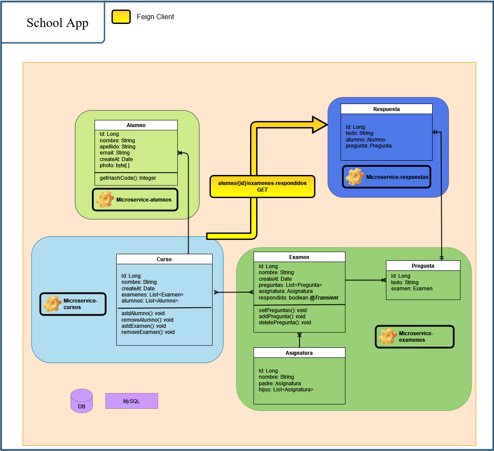
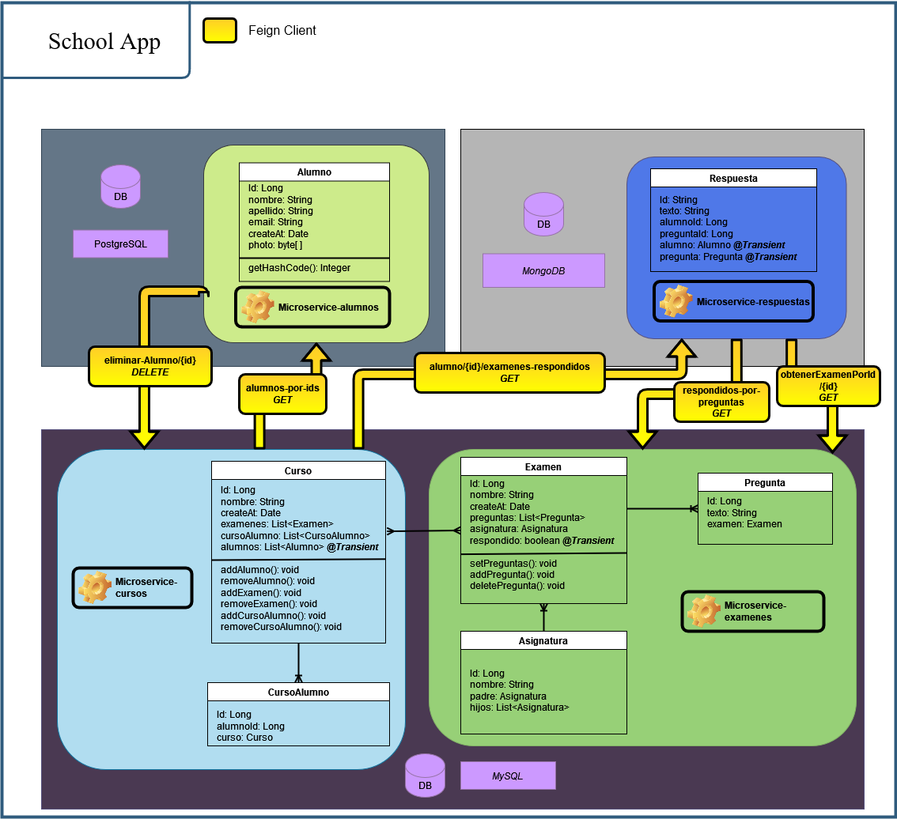

# School App

## _Implementation of a school system_
- The Front-end is build with Angular.
- The Back-end is build with spring boot microservices.

##  System Diagram : Shared DB 

## Second System Diagram : Distributed DB

## Tech
Escuela App uses these repositories to work properly:
 
| REPOS | LINK |
| ------ | ------ |
| Angular | https://github.com/IvanCruzMoreno/Escuela-FrontEnd |
| Eureka | https://github.com/IvanCruzMoreno/microservice-eureka |
| Commons | https://github.com/IvanCruzMoreno/microservice-commons |
| Cursos | https://github.com/IvanCruzMoreno/microservice-cursos/tree/db_distribuidas |
| Examenes | https://github.com/IvanCruzMoreno/microservice-examenes/tree/db_distribuidas |
| Gateway | https://github.com/IvanCruzMoreno/microservice-gateway |
| Respuestas | https://github.com/IvanCruzMoreno/microservice-respuestas/tree/db_distribuida |
| Alumnos | https://github.com/IvanCruzMoreno/microservice-alumnos/tree/db_distribuidas |
| Zuul | https://github.com/IvanCruzMoreno/microservice-zuul |

_Notes:_ 
- _You can use Zuul or Gateway_
- _There are two implementations for the back-end, one is the master branch and the second is 'db_distribuidas'. I used the db_distribuidas._

