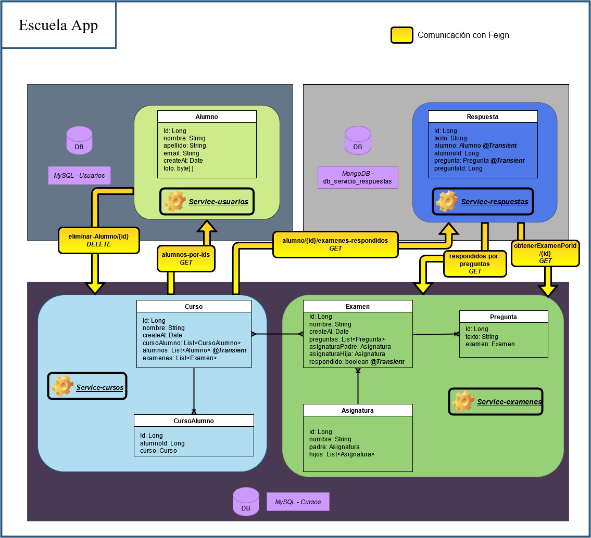
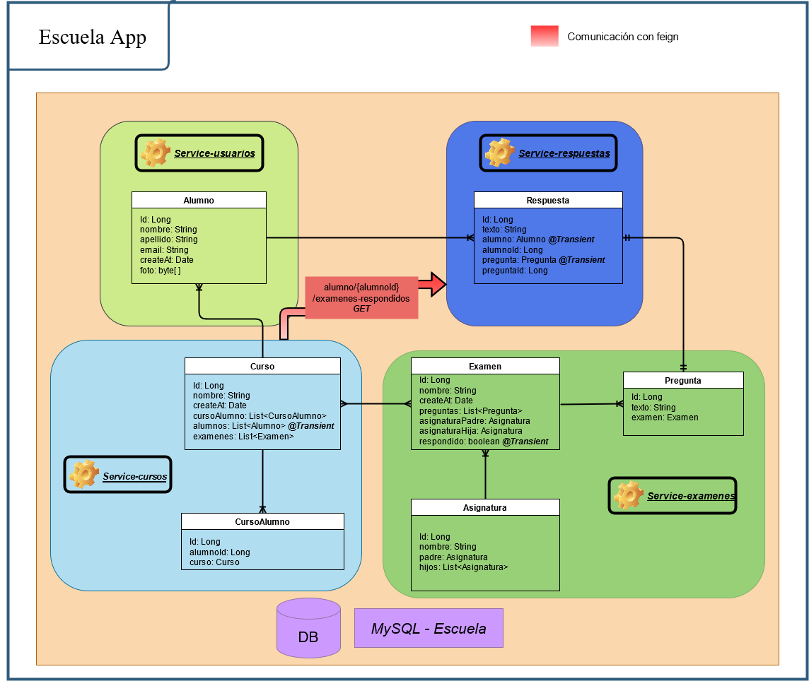

# Escuela App

## _Implementation of a school system_
- The Front-end is build with Angular.
- The Back-end is build with spring boot microservices.

##  System Diagram

## Tech
Escuela App uses these repositories to work properly:
 
| REPOS | LINK |
| ------ | ------ |
| Angular | https://github.com/IvanCruzMoreno/Escuela-FrontEnd |
| Eureka | https://github.com/IvanCruzMoreno/eureka_server |
| Commons | https://github.com/IvanCruzMoreno/service_commons/tree/secondImplArc |
| Cursos | https://github.com/IvanCruzMoreno/service_cursos/tree/secondImplArc |
| Examenes | https://github.com/IvanCruzMoreno/service_examenes/tree/secondImplArc |
| Gateway | https://github.com/IvanCruzMoreno/service_gateway |
| Respuestas | https://github.com/IvanCruzMoreno/service_respuestas/tree/secondImplArc |
| Usuarios | https://github.com/IvanCruzMoreno/service_alumno |
| Zuul | https://github.com/IvanCruzMoreno/service_zuul |

_Notes:_ 
- _You can use Zuul or Gateway_
- _There are two implementations for the back-end, one is the master branch and the second is 'secondImplArc'. I used the secondImplArc._

### _Second System Diagram_

